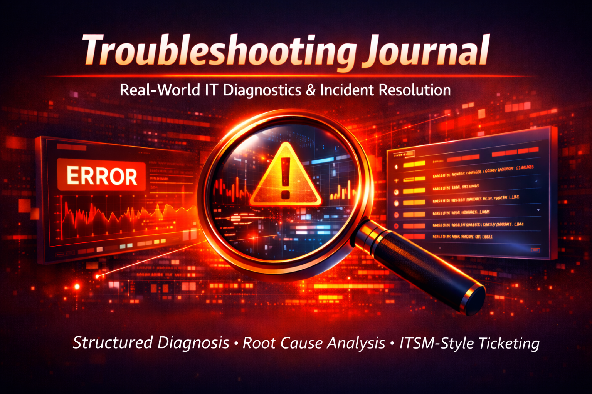
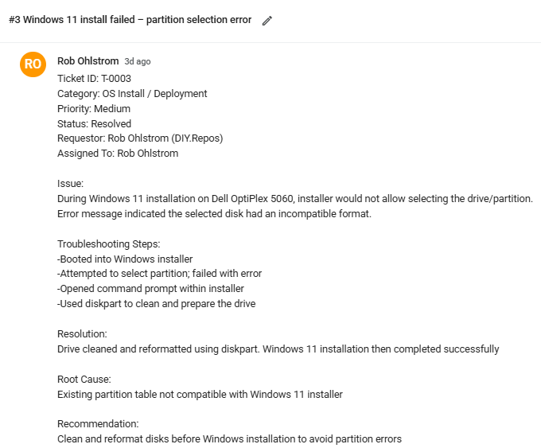
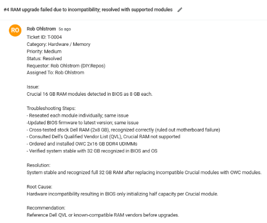
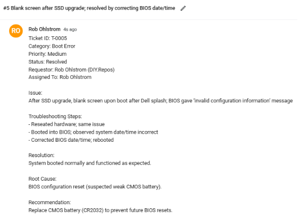
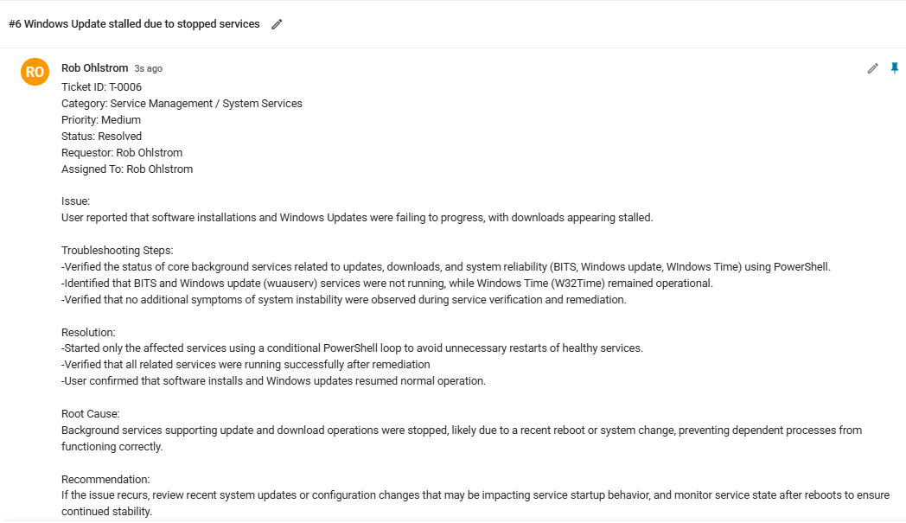
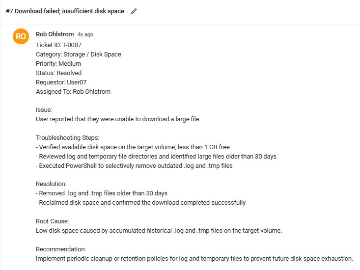
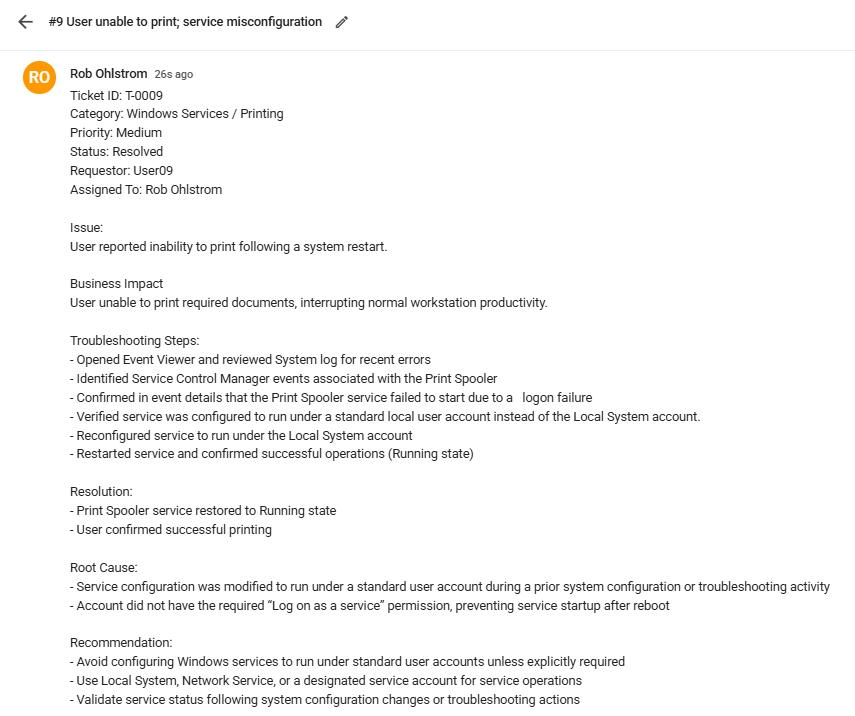
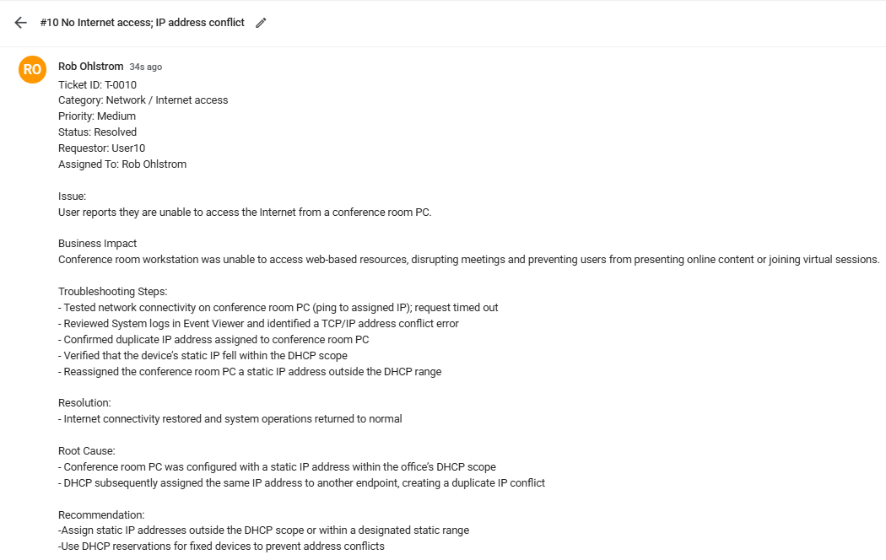
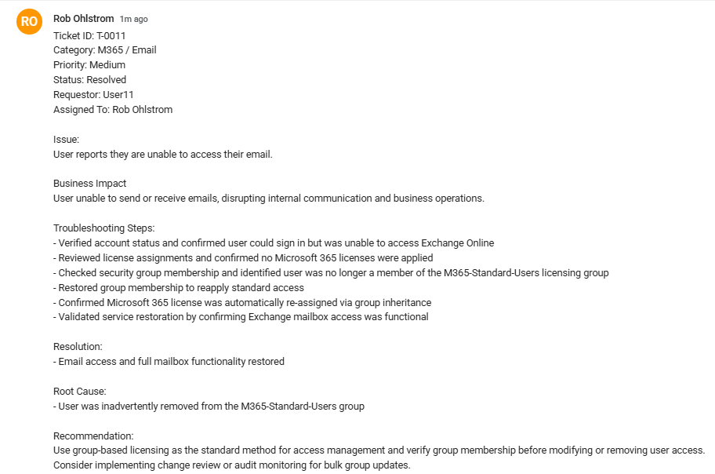
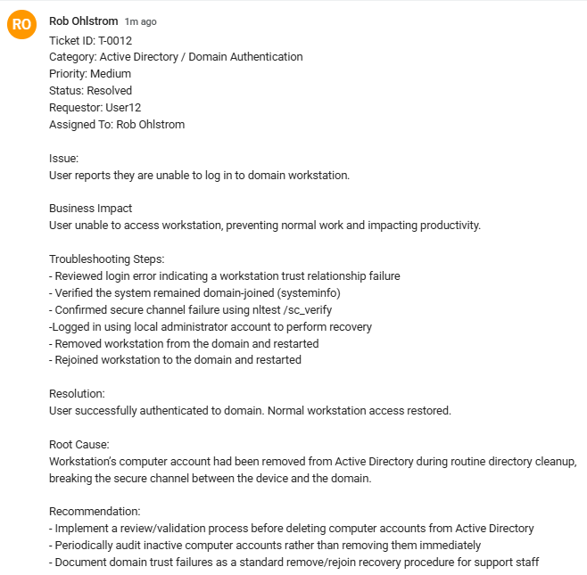

 
 ## Operational Relevance 

This project documents troubleshooting activities that arose while working on other projects, as well as simulated troubleshooting scenarios involving Active Directory (AD), Microsoft 365 (M365), software tools, networking, and PowerShell. Documentation is recorded in an ITSM-style ticketing format that aligns with professional IT Support workflows.

## Example: T-0003

 
 T-0004 RAM Compatibility Issue - Desktop Refurbishment Repository

 
 
 

 
 T-0005 Blank Screen after SSD Upgrade - Desktop Refurbishment Repository 

 
 

 
 T-0006 Windows Update Stalled - Desktop Refurbishment Repository 

 
 

 
 T-0007 Download Failed - PowerShell Foundations Repository 

  
  
 

 
 T-0008 User unable to save files locally - Active Directory Repository 

 
 T-0009 User unable to print - Software Tools Repository 

 

 
 T-0010 No Internet - IP Address Conflict - Networking Foundations Repository

 
 

 
 T-0011 Email Malfunctioning - Inadvertant License Removal - M365 Repository

 
 

 
 T-0012 Domain-Join Failure - Broken Trust Relationship - Active Directory Repository

 
 

[**Back to Desktop Refurb Repository](https://github.com/robohlstrom24/desktop-refurb)

[**Back to PowerShell Foundations Repository](https://github.com/robohlstrom24/powershell-foundations)

[**Back to Active Directory Lab Repository](https://github.com/robohlstrom24/AD-lab)

[**Back to Software Tools Repository](https://github.com/robohlstrom24/software-tools)

[**Back to Networking Foundations Repository](https://github.com/robohlstrom24/networking-foundations)

[**Back to Microsoft 365 Repository](https://github.com/robohlstrom24/M365)

