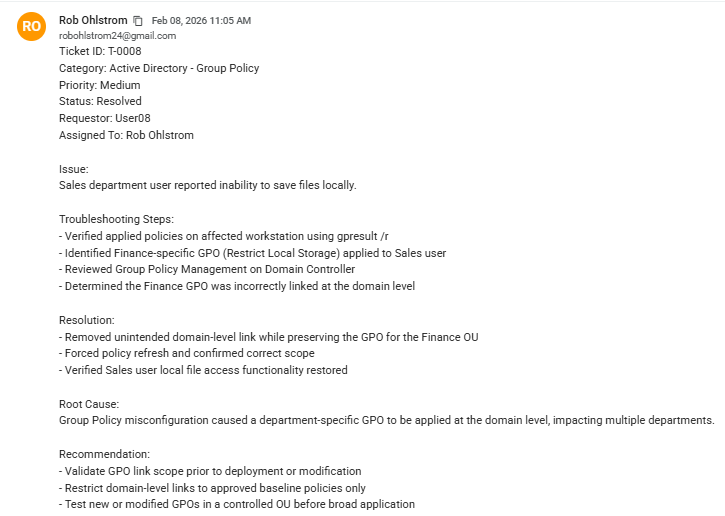
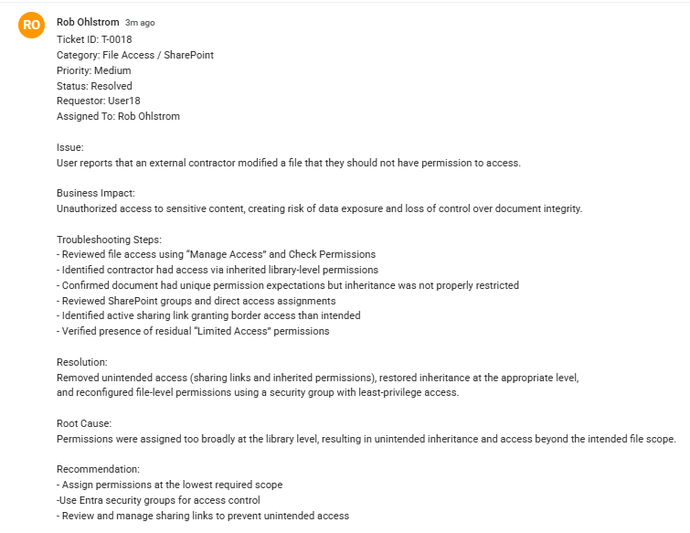
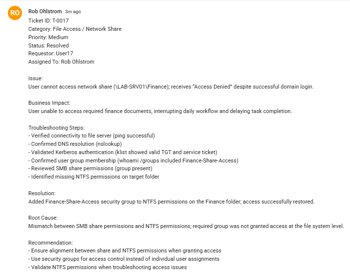
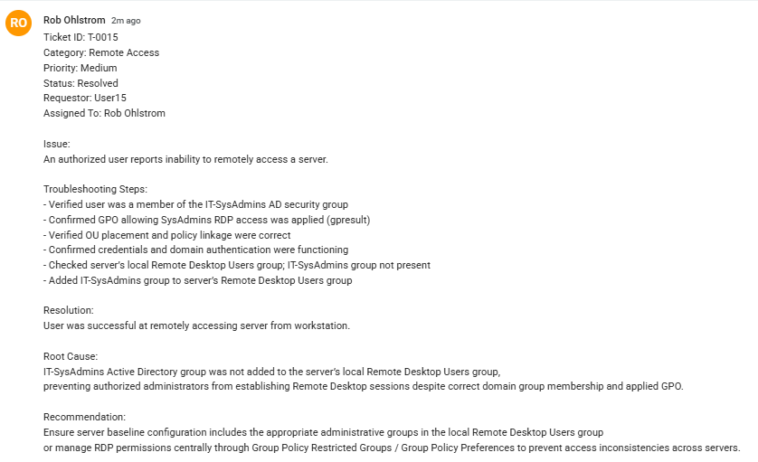
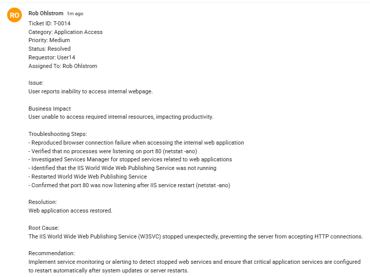
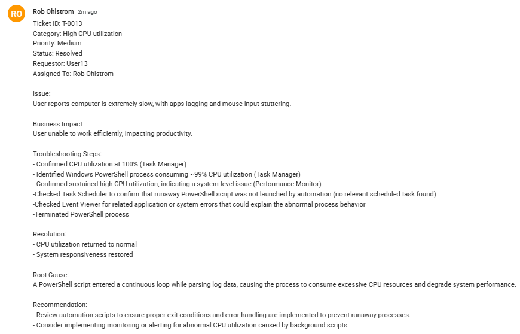

 
 ## Operational Relevance 

This project documents troubleshooting activities which are simulated in a home lab environment. Documentation is recorded in an ITSM-style ticketing format that aligns with professional IT Support workflows. Click the > drop-down to view each ticket.

## Job Skills Demonstrated

- ITSM Ticketing and Documentation
- Active Directory and Permissions Troubleshooting (T-0008, T-0012, T-0017)
- Microsoft 365 & Identity Troubleshooting (T-0011, T-0015, T-0018)
- Network & Systems Diagnosis (T-0010, T-0013, T-0014)
- Endpoint & Hardware Support (T-0003, T-0004, T-0005, T-0006) 

## Example: T-0008 User unable to save files locally - Active Directory Repository

 
 T-0018 Overly Broad SharePoint Permissions | Unintended Access (M365 Repository)

 
 

 
T-0017 Inaccessible Network Share | Permissions Mismatch (Active Directory Repository)

 
 

 
 T-0015 RDP Server access failure | GPO Application (Hybrid Identity Lifecycle Lab) 

 
 

 
 T-0014 Web Application Unavailable | Stopped Service (Software Tools Repository) 

 
 

 

 T-0013 High CPU Utilization | Runaway Script (Software Tools Repository) 
 

 
 T-0012 Domain-Join Failure | Broken Trust Relationship (Active Directory Repository) 

 
 
 

 
 T-0011 Email Malfunctioning | Inadvertant License Removal (Microsoft 365 Repository) 

 
 

 
 T-0010 No Internet | IP Address Conflict (Networking Foundations Repository) 

 
 

 
 T-0009 User Unable to Print | Event Viewer Diagnostics (Software Tools Repository) 

 

 
 T-0007 Download Failed | Temp File Cleanup (PowerShell Foundations Repository) 

  
  
 

 
 T-0005 Blank Screen After SSD Upgrade | BIOS Date/Time (Desktop Refurbishment Repository) 

 
 

 
 T-0004 RAM Compatibility Issue | Qualified Vendor List (Desktop Refurbishment Repository) 

 
 
 

 
T-0003 Windows 11 Install Failed | Partition Selection Error (Desktop Refurbishment Repository) 

 
  
  

[**Back to Desktop Refurb Repository](https://github.com/robohlstrom24/desktop-refurb)

[**Back to PowerShell Foundations Repository](https://github.com/robohlstrom24/powershell-foundations)

[**Back to Active Directory Lab Repository](https://github.com/robohlstrom24/AD-lab)

[**Back to Software Tools Repository](https://github.com/robohlstrom24/software-tools)

[**Back to Networking Foundations Repository](https://github.com/robohlstrom24/networking-foundations)

[**Back to Microsoft 365 Repository](https://github.com/robohlstrom24/M365)

