 
## Operational Relevance

A structured ticket log documenting Tier 1/2 troubleshooting scenarios managed in Jira Service Management. The project also demonstrates broader JSM platform fluency including priority-based ticket organization, impact triage, and Microsoft Teams integration for real-time queue notifications.

## Job Skills Demonstrated

- ITSM Ticketing and Documentation
- Active Directory Troubleshooting (T-0008, T-0012)
- M365 & Identity Troubleshooting (T-0011, T-0018)
- Network Troubleshooting (T-0010, T-0015, T-0017)
- Windows Services & Software Tools (T-0006, T-0009, T-0013, T-0014)
- PowerShell Troubleshooting (T-0007)
- Hardware Diagnosis & Support (T-0004, T-0005)

---

## Category Overview

| Category | Tickets | Key Tools / Concepts |
|---|---|---|
| [Active Directory](#active-directory) | 2 | gpresult, GPMC, nltest, domain trust, computer accounts |
| [M365](#m365) | 2 | Exchange Online, group-based licensing, SharePoint permissions |
| [Network](#network) | 3 | DHCP, IP conflict, RDP, NTFS, netstat, ping |
| [Windows Services & Software Tools](#windows-services--software-tools) | 4 | Event Viewer, Services Manager, Performance Monitor, Task Manager, IIS |
| [PowerShell Troubleshooting](#powershell-troubleshooting) | 1 | PowerShell, disk cleanup, log/temp file remediation |
| [Hardware](#hardware) | 2 | BIOS, CMOS, RAM compatibility, QVL |

---

## Active Directory

[Back to top](#troubleshooting-journal)

T-0008 · Sales user unable to save files locally – Finance GPO incorrectly linked at domain level

[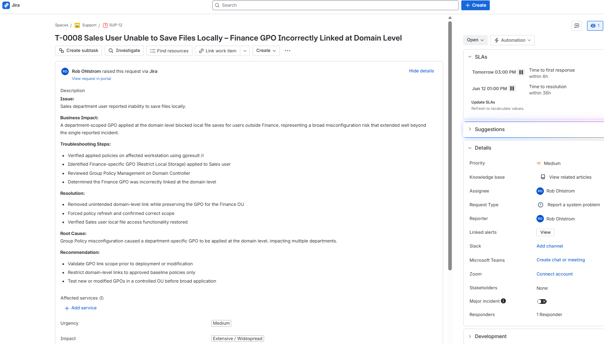](images/Jira/T-0008.png)

T-0012 · Domain login failure – broken trust relationship after computer account deletion

[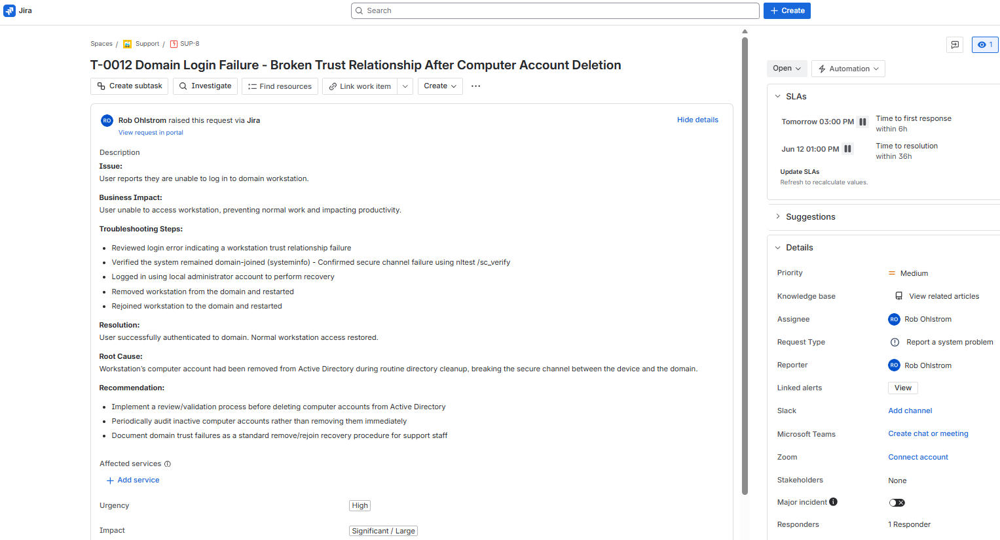](images/Jira/T-0012.png)

---

## M365

[Back to top](#troubleshooting-journal)

T-0011 · Exchange Online access lost – user removed from M365 licensing group

[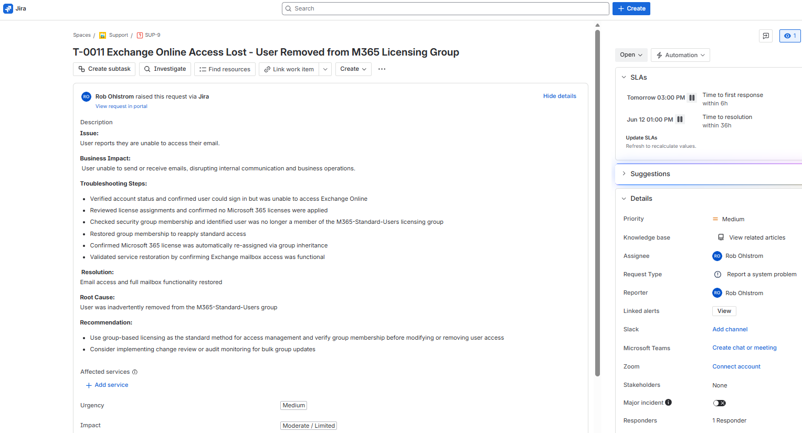](images/Jira/T-0011.png)

T-0018 · External user granted excessive SharePoint permissions

[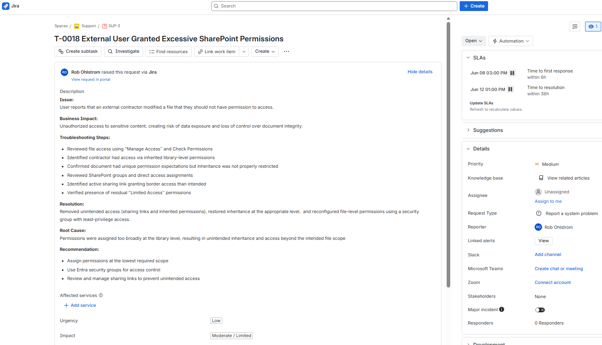](images/Jira/T-0018.png)

---

## Network

[Back to top](#troubleshooting-journal)

T-0010 · Conference room PC no internet access – duplicate IP address conflict with DHCP scope overlap

[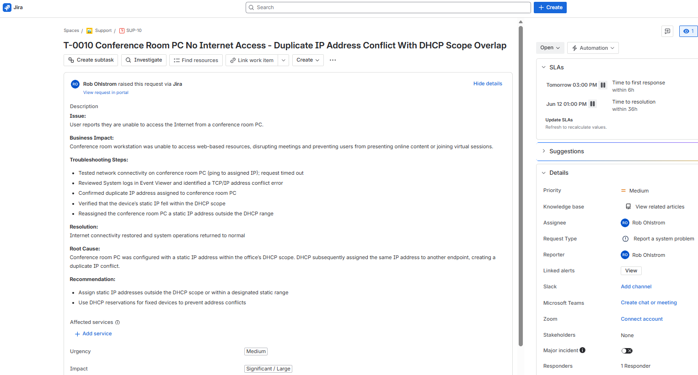](images/Jira/T-0010.png)

T-0015 · RDP access blocked – missing local Remote Desktop Users group entry

[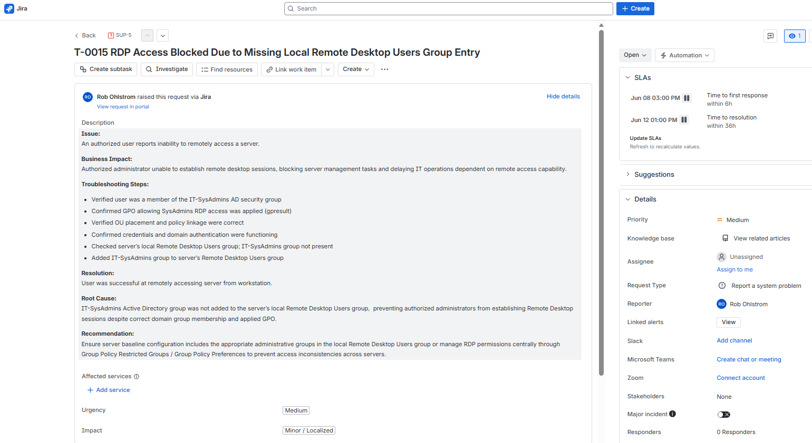](images/Jira/T-0015.png)

T-0017 · Network share access denied – NTFS permission mismatch

[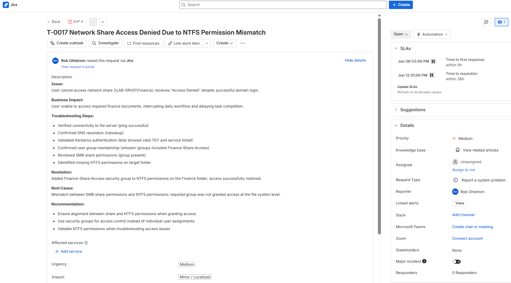](images/Jira/T-0017.png)

---

## Windows Services & Software Tools

[Back to top](#troubleshooting-journal)

T-0006 · Windows Update stalled – BITS and Windows Update services stopped

T-0009 · Print Spooler fails to start after reboot – service account misconfiguration causing logon failure

[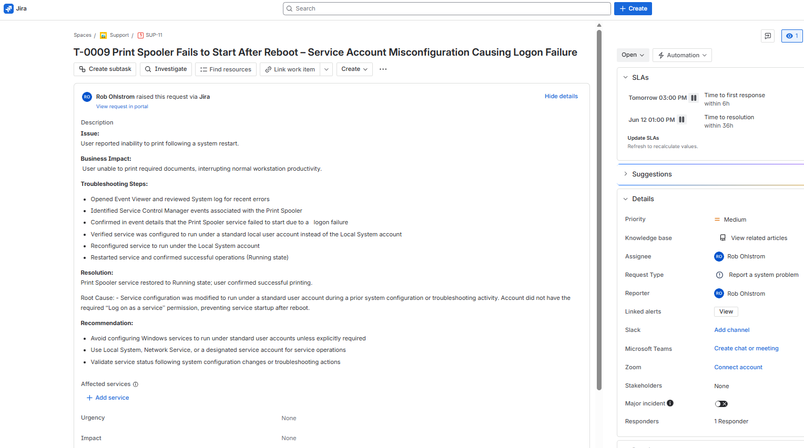](images/Jira/T-0009.png)

T-0013 · Workstation performance degraded – runaway PowerShell script causing 100% CPU utilization

[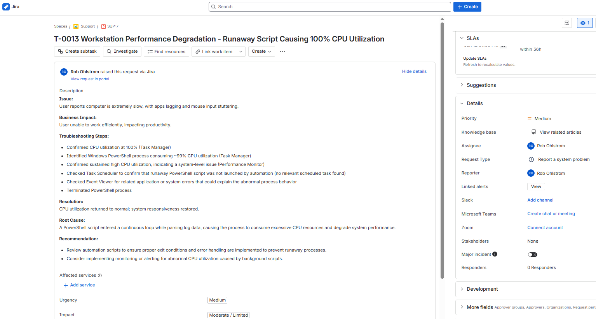](images/Jira/T-0013.png)

T-0014 · Internal web application inaccessible – IIS W3SVC service stopped

[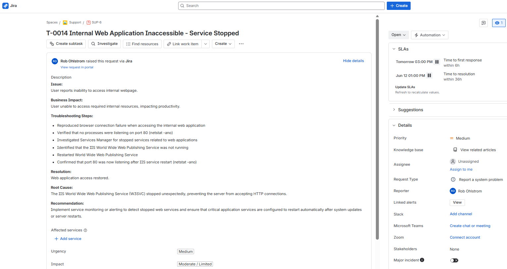](images/Jira/T-0014.png)

---

## PowerShell Troubleshooting

[Back to top](#troubleshooting-journal)

T-0007 · Large file download failing – disk space exhausted by accumulated log and temp files

[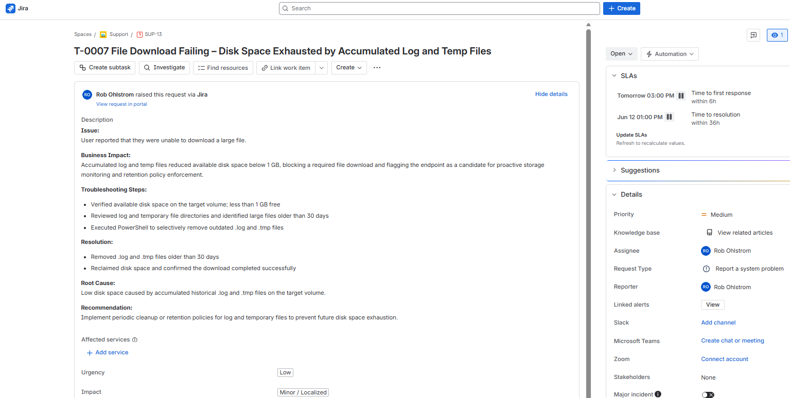](images/Jira/T-0007.png)

---

## Hardware

[Back to top](#troubleshooting-journal)

T-0004 · RAM upgrade reporting half capacity – Crucial modules not on Dell QVL causing BIOS initialization failure

[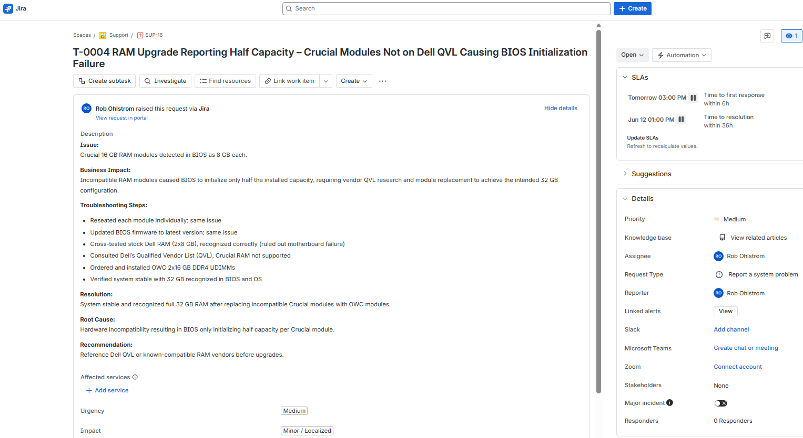](images/Jira/T-0004.png)

T-0005 · System fails to boot after SSD upgrade – BIOS configuration reset due to weak CMOS battery

[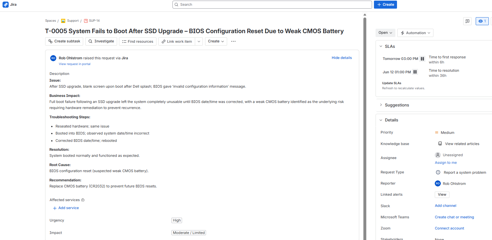](images/Jira/T-0005.png)

[**Back to Microsoft 365 Repository](https://github.com/robohlstrom24/M365)

[**Back to Active Directory Lab Repository](https://github.com/robohlstrom24/AD-lab)

[**Back to Software Tools Repository](https://github.com/robohlstrom24/software-tools)

[**Back to Networking Foundations Repository](https://github.com/robohlstrom24/networking-foundations)

[**Back to Desktop Refurbishment Repository](https://github.com/robohlstrom24/desktop-refurb)

[**Back to PowerShell Foundations Repository](https://github.com/robohlstrom24/powershell-foundations)

